```{r setup, include=FALSE}
# Use the following commands to set any document-wide R chunk options
knitr::opts_chunk$set(echo = TRUE, warning=FALSE)
# neural_data <- read.csv("neural_data.txt", sep="\t")
full_raw_netw_first_sec <- dget("full_sugihara_network_raw_data_first_second.RData")
full_spline_netw_first_sec <- dget("full_sugihara_network_spline_data_first_second.RData")
```
This is an R Markdown document. Markdown is a simple formatting syntax for authoring HTML, PDF, and MS Word documents. For more details on using R Markdown see <http://rmarkdown.rstudio.com>.


#### Note
Unless explicitly stated otherwise, the data analysis in this document pertain only to the first second of 500 during the experiment.

# Sugihara Cross Map Skill ($\rho$) analysis

First we measured pairwise Sugihara cross map skill ($\rho$) measure. Most of the pairs showed high causality measures as shown by the histogram.

```{r}
hist(full_raw_netw_first_sec$strength, main="Distribution of cross map skill using raw signal \n between region pairs during first second", xlab=expression(paste("cross map skill (", rho,")")), ylim=c(0,200))
```

```{r}
hist(full_spline_netw_first_sec$strength, main="Distribution of cross map skill using spline signal \n between region pairs during first second", xlab=expression(paste("cross map skill (", rho,")")), ylim=c(0,200))
```

Then we observe that many of the pairs have very similar $\rho$ measure between them. This indicates that if region $a$ causes region $b$, then it is likely that region $b$ also causes region $a$. And since there are many causal relationships in this network, then it can be deduced the majority of the regions cause one another.

```{r}
#create an empty list to store the data
rho_diff <- c()
for (i in 1:31)
{
  for (j in 1:31)
  {
    if (i != j)
    {
      #get the difference of causality between i -> j and i <- j
      rho_diff <- c(rho_diff, full_raw_netw_first_sec$strength[full_raw_netw_first_sec$from==i & full_raw_netw_first_sec$to==j] -
                        full_raw_netw_first_sec$strength[full_raw_netw_first_sec$from==j & full_raw_netw_first_sec$to==i])
    }
  }
}
hist(rho_diff, xlim=c(-1,1), ylim=c(0,350), main = "",
     xlab=expression(paste("Difference in ", rho, " between regions in each pair")))
```

```{r}
#create an empty list to store the data
rho_diff <- c()
for (i in 1:31)
{
  for (j in 1:31)
  {
    if (i != j)
    {
      #get the difference of causality between i -> j and i <- j
      rho_diff <- c(rho_diff, full_spline_netw_first_sec$strength[full_spline_netw_first_sec$from==i & full_spline_netw_first_sec$to==j] -
                        full_spline_netw_first_sec$strength[full_spline_netw_first_sec$from==j & full_spline_netw_first_sec$to==i])
    }
  }
}
hist(rho_diff, xlim=c(-1,1), ylim=c(0,350), main = "",
     xlab=expression(paste("Difference in ", rho, " between regions in each pair")))
```


# Examining unidirectional forcing

However, as [Ye pointed out](http://www.nature.com/articles/srep14750) recently, this could be due to unidirectional forcing of one region on another. This means if region $a$ strongly dictates region $b$'s behavior, then naturally the state of $b$ can be deduced from that of $a$, but also that the state of $a$ can also be deduced form the state of $b$. This is because the dynamic of $b$ become "enslaved" to the dynamics of $a$. This is the problem of "synchrony". Although the Sugihara model would measure both $a$ and $b$ as causal to one another, the truth could be and in fact is that the only causal relationship is from $a$ to $b$, and not the other way around.

This problem can be allayed as Ye suggests by looking at the lags of each causal relationship in order to determine which variable best predicts the other in the past, and which best predicts the other in the future. If $b$ is enslaved by $a$ with a lag of 2 time periods, then $b$ will be able to predict the past of $a$ with a maximum $\rho$ around negative 2 lag periods. Conversely, $a$ is able to bet predict the future of $b$ with a maximum $\rho$ around positive 2 periods (This is shown well in in Figure 2 of [Ye et al.](http://www.nature.com/articles/srep14750). 

So in order to allay the problem of unidirectional forcing, we examine the lags of each pair. This is a tricky problem because there is no clear range for which to test the lag, since we are unsure of the time delay for neuronal activity, and how that translates to EEG data. As a simple measure, we test for lag in the 30 range.

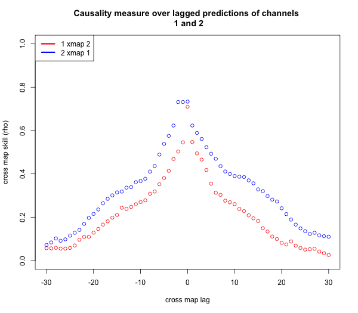
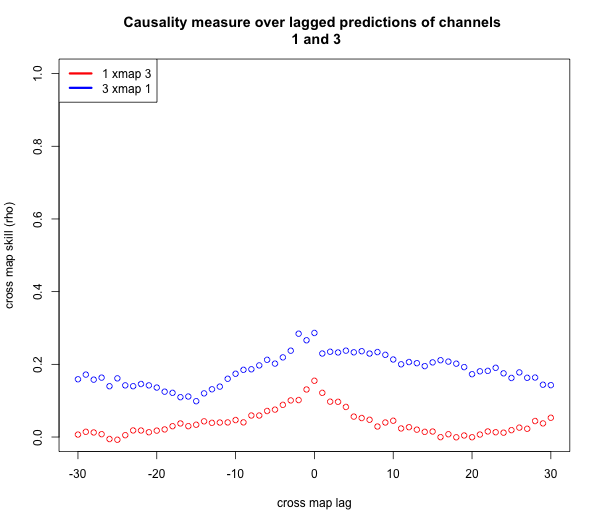
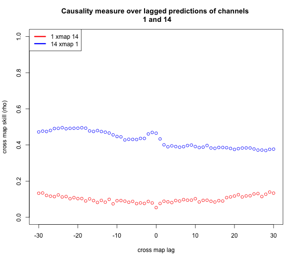
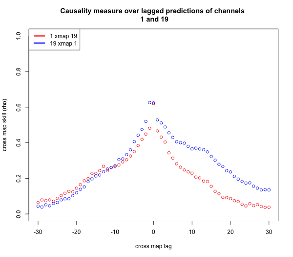
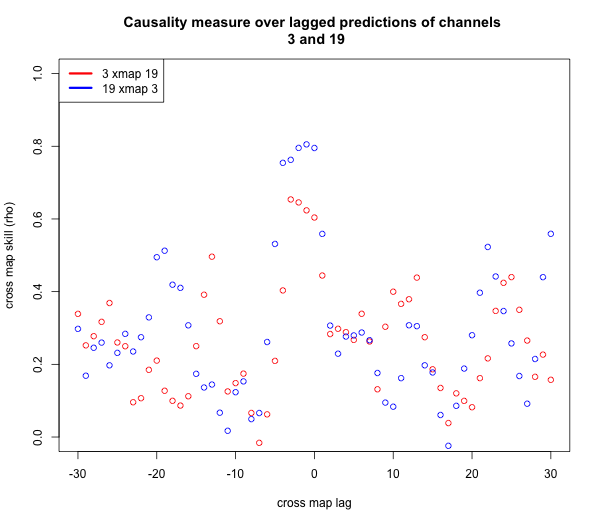
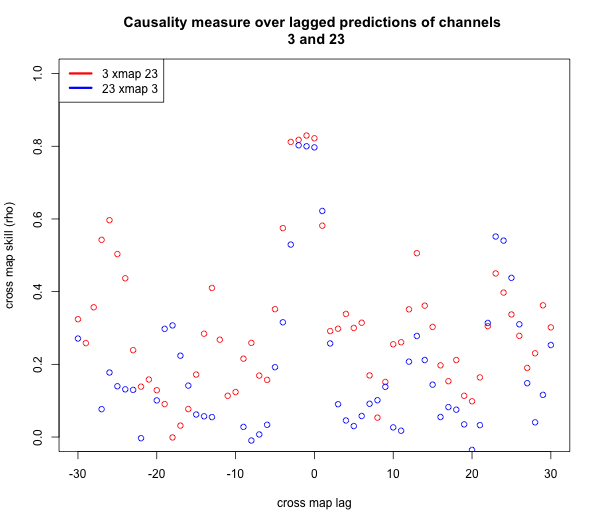

Seeing from the plots above, we can observe various behaviors, and since there are 465 combinations, it becomes unfeasible to analyze all the plots by hand, so we propose a heuristic measure we call the *left lag mean difference* (LLMD), which describes the difference between the mean of the left lag of $a$ xmap $b$ and $b$ xmap $a$. If the LLMD of $a$ xmap $b$ vs. $b$ xmap $a$ is positive, then the unidirectional forcing relationship (*if* present) is $b$ causes $a$ because the lagged plot of $a$ xmap $b$ is skewed more to the left, so that is the more causal relationship.

There are serious weaknesses to the LLMD method, mainly its linear property and that it does not give intelligible answers when the relationship is unclear like when both causal lines cross each other multiple times like in channels 1 and 19, or when the relationship is almost symmetric like in channels 1 and 2. Therefore, a better measure that can properly discriminate between two unidirectional forcing possibilities is needed. 

# Defining a Causal Connection and Creating a Graph
 
It is still unclear, in the presence of a possibility of unidirectional forcing, how to clarify if the relationship is unidirectional or in truth simply bidirectional. Heuristic measures might be used, but a statistical approach is needed for mathematical rigor.

Another problem with lacking a clear mathematical definition of rejecting and accepting a Sugihara causality measure is that the network could be a complete graph because all the causality measures converge to a value. The reason for having what might seem like a complete graph is the transitivity property of Sugihara Causality. For example, if $a$ causes $b$ and $b$ causes $c$, then convergent cross mapping will detect a causation from $a$ to $c$, but to a lesser degree than the direct causation. Therefore, the presence of many connections could be the side effect of a cascading flow of information.Therefore, a measure to discriminate causality from cascading is also needed.

For now, we offer two simple heuristic measures to obtain an initial graph.

1. Top causal relationship  
For each node $n_i$ in the node set $N = {n_1,n_2,n_3, \dots, n_{31}}$, we find the node $n_j$ such that the convergent cross mapping skill from $n_i$ to $n_j$, $\rho_{i,j}$, is the maximum, and LLMD is positive, and we create an directed edge from $n_j$ to $n_i$ with weight $\rho_{i,j}$. Another constraint is that $n_i \neq n_j$. This translates to finding for each node the node that causes it the most, and forming an edge with the causation strength from it.

This produces the graph below


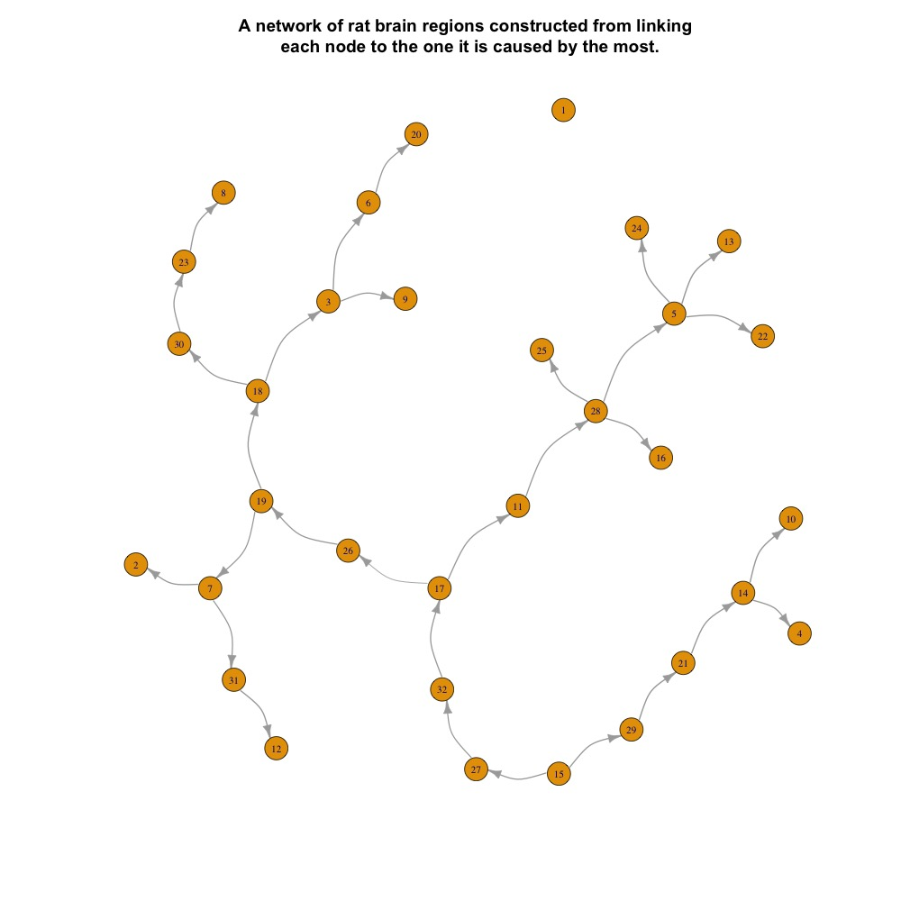
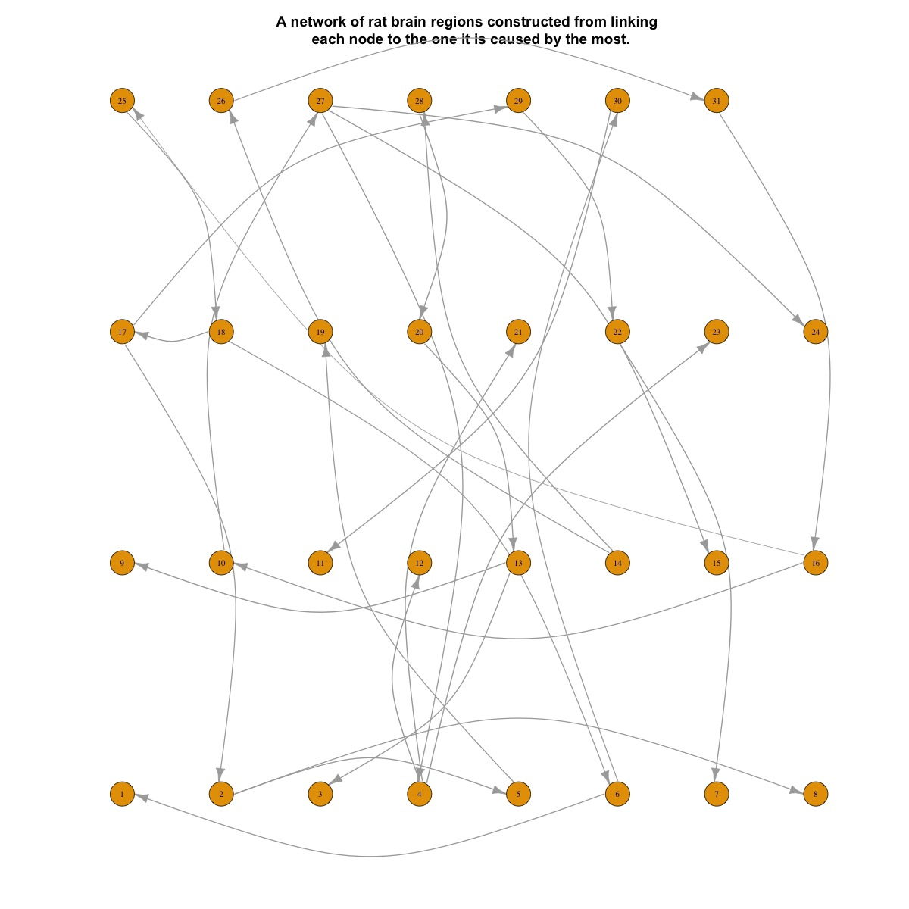

2. Since it is obvious that each brain region is not necessarily caused by only one other brain region, we use another heuristic: $\rho$ values above a certain threshold $\rho_t$, and with a positive LLMD, will be accepted as being causal.

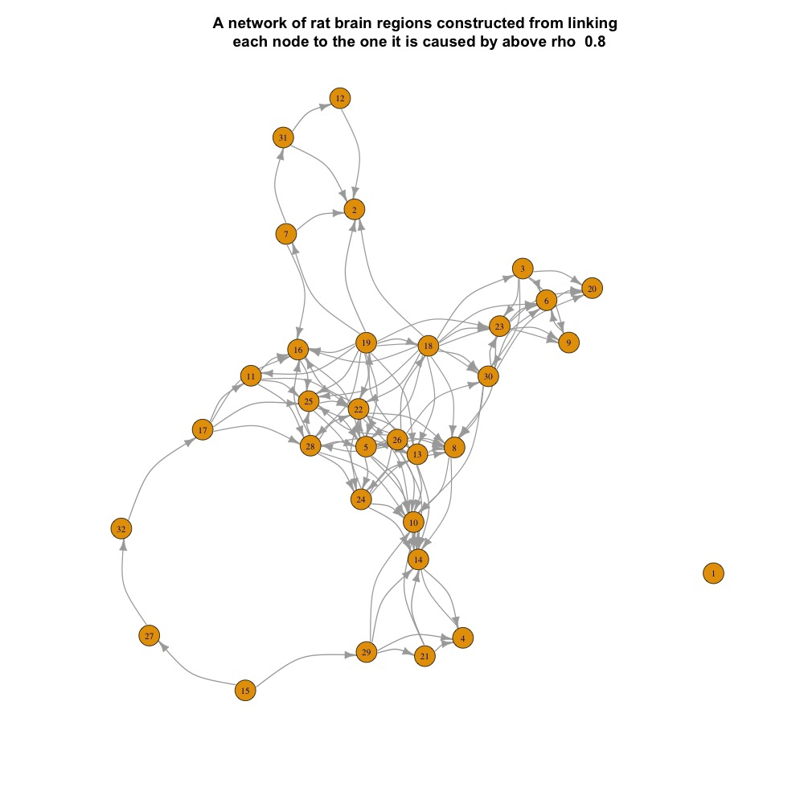
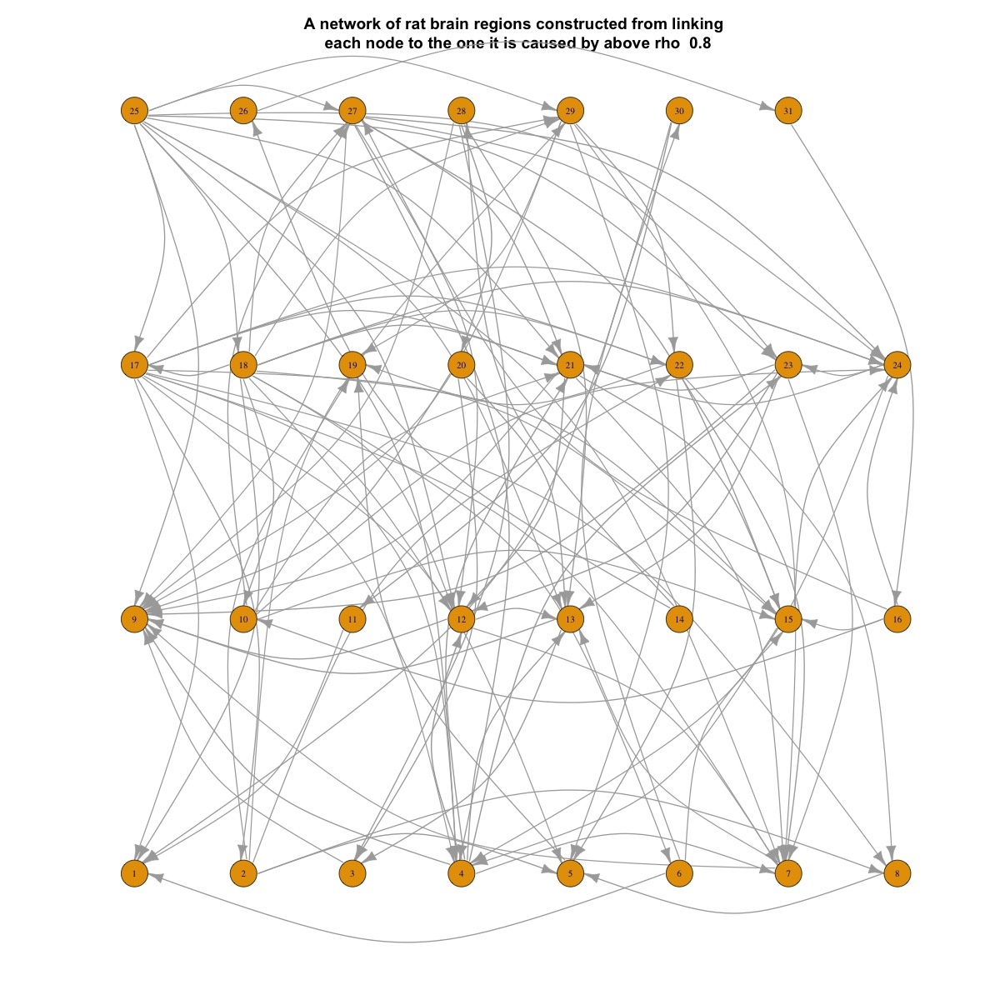

# Time Requirement

We noticed as we ran the cross mapping algoirthm on the time series that the time requirement was too large, especially when attempting to get the convergence factor, since we need to run the algoirthm for multiple library sizes to observe the behavior as library sizes grow. Moreover, we run the algoirthm for multiple lag periods to calculate the LLMD which increased the time complexity of our causality calculation. To allay this problem, we experimented with reducing the sampling size in the ccm algorithm.

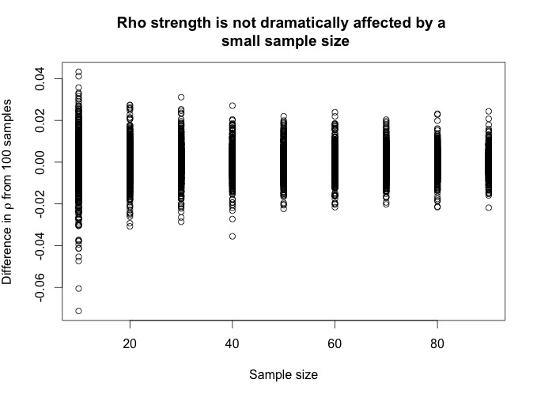

As can be seen from the figure above, the reduction of the sampling size does not have a dramatic effect on the variability of the $\rho$ values. Therefore, we decided to always run our ccm algorithm using 20 sample size instead of the default 100. 

Furthermore, since we observe that majority of cross maps are convergent, we no longer calculate the progression of library sizes, and only take into account library size 80.

#Significance Testing

Since we removed the progression of library sizes from our model, we must use another method to quantify a significant cross map skill $\rho$. For this, we use what has been suggested by [Nes et al.](http://www.nature.com/nclimate/journal/v5/n5/full/nclimate2568.html) and carry a bootstrap transformation over the data using random shuffling or Fourier Phase Transform, and counting the causality measure to be significant if it is above the 95% of the bootstrap distribution. (An explanation of how to do this can be found at [the rEDM package vignette, Seasonal Surrogate Test](https://cran.r-project.org/web/packages/rEDM/vignettes/rEDM_tutorial.html) )


